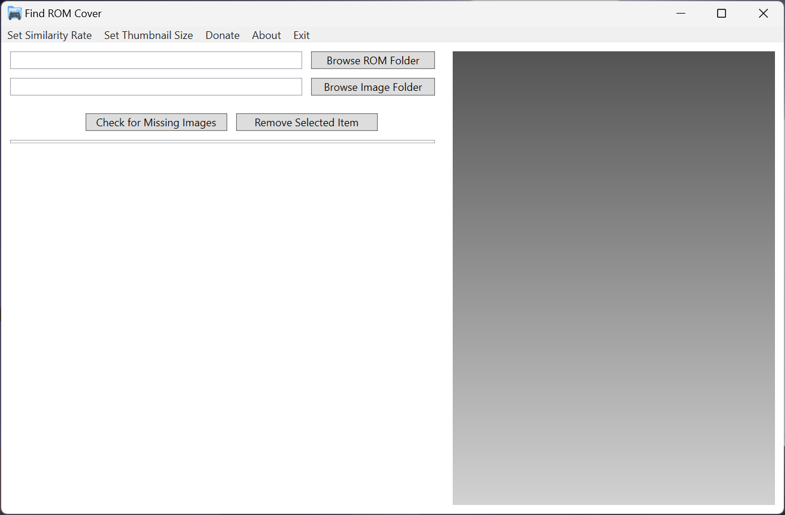
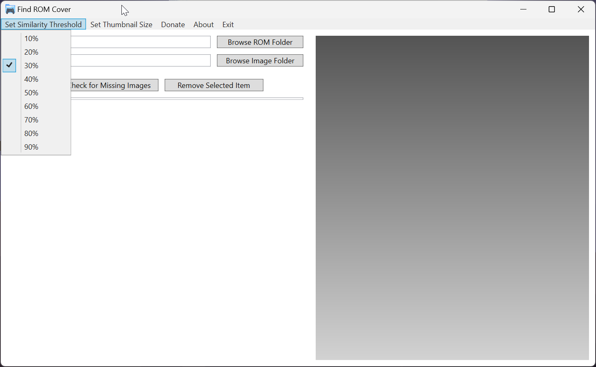

# Find ROM Cover

Find ROM Cover is an easy-to-use application designed to help you effortlessly rename and organize cover images for your ROM collection. There's no need to manually rename your images to match the filenames of your ROMs.

## Screenshots:

## How It Works:

- **Browse:** Select the folders where your ROMs and cover images are stored.

- **List:** It will list which cover images are missing for your ROM collection.

- **Match:** The app will search within the Cover Image folder for an image with a similar filename. Adjust the similarity threshold to find the best matches.

- **Display:** Displays suggestions for cover images on the right panel for the selected ROM. You can adjust the size of the image previews.

- **Organize:** Manually select the best cover images from the suggestions provided.

- **Copy:** Click on the image to copy it to the Cover Image folder, renaming the image to match the ROM file name.

## Features:

- **Easy ROM and Cover Image Matching:** Automatically matches your ROM files with their corresponding cover images based on name similarity.

- **Adjustable Similarity Threshold:** Fine-tune how strict the matching criteria should be. Whether you prefer exact matches or broader suggestions, you have the control.

- **Thumbnail Size Customization:** Choose how large or small you want the cover image thumbnails to appear, making it easier to view and select the right covers.

- **Manual Selection:** Browse through suggested images and pick the perfect cover for each ROM, ensuring your collection looks exactly how you want it.

- **Missing Image Finder:** Quickly identify which ROMs are missing cover images, helping you complete your collection.

- **Simple Interface:** Designed for ease of use, making it accessible to everyone, regardless of tech-savviness.

## Where can I find ROM Cover Images?

You can find cover images on websites such as [Libretro Thumbnails](https://github.com/libretro-thumbnails/libretro-thumbnails) and [EmuMovies](https://emumovies.com/), with which I have no affiliation.

## Support the Project:

Did you enjoy using Find ROM Cover? Consider [donating](https://www.buymeacoffee.com/purelogiccode) to support the project or simply to say thanks!

## Developer:

This project was developed by a [Simple Launcher](https://github.com/drpetersonfernandes/SimpleLauncher) developer to assist in organizing his cover image collection.

Peterson Fernandes - [Github Profile](https://github.com/drpetersonfernandes)

## Technical Details:

Find ROM Cover was written in C# using Microsoft Visual Studio Community 2022 (64-bit) and the Windows Presentation Foundation (WPF) framework with Microsoft .NET 8.0. 
This program is designed exclusively for Windows, with compatibility expected from Windows 7 and later versions. It has been tested on Windows 11.