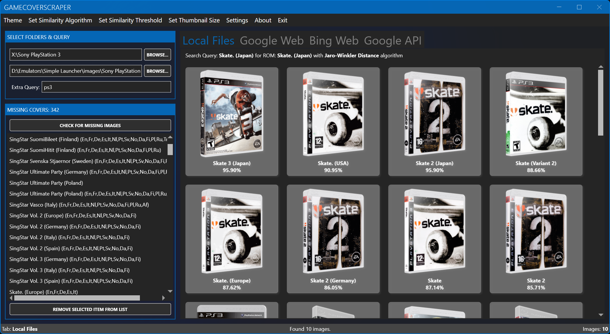
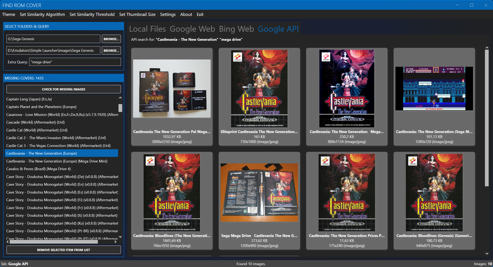

[](https://github.com/drpetersonfernandes/FindRomCover/releases)
[](https://github.com/drpetersonfernandes/FindRomCover/releases)
[](LICENSE.txt)

# FindRomCover

A powerful Windows desktop application designed to help you automatically find and download missing cover art for your retro gaming ROM collection.
It supports **Bing Web Image Search**, **Google Web Image Search**, and **Google Custom Search API** to fetch high-quality game cover images.





## Features

- **Smart Search**: Automatically searches for game covers using cleaned ROM filenames.
- **MAME Integration**: Leverages MAME database for accurate game titles and descriptions.
- **Batch Processing**: Scan entire ROM directories to identify missing covers.
- **Multiple Sources**:
    - **Bing Web Image Search**: Uses an embedded browser (WebView2) to display Bing image search results.
    - **Google Web Image Search**: Uses an embedded browser (WebView2) to display Google image search results.
    - **Google Custom Search API**: Fetches image results directly via API (requires an API key).
- **Real-time Preview**: Thumbnail previews with configurable sizes (100-500px).
- **Customizable UI**: Light/Dark themes with 20+ accent colors.
- **Missing Covers List**: Automatically generates a list of ROMs without corresponding cover art (checks for PNG, JPG, BMP, GIF, TIFF, WebP, AVIF).
- **Flexible Configuration**: Support for custom file extensions and search queries.
- **Automatic Image Conversion**: Automatically converts downloaded images (JPG, BMP, GIF, TIFF, WebP, AVIF, HEIC, HEIF, JXL, JP2) to PNG format using Magick.NET (ImageMagick). Also, automatically converts newly saved images in the image folder to PNG.
- **Detailed Logging**: Built-in log viewer for troubleshooting and `app.log`/`error.log` files using Serilog.
- **Sound Feedback**: Optional audio feedback for user actions using NAudio.
- **Command-line Arguments**: Start the application with pre-set ROM and Image folders for quick scanning.
- **Auto-Copy to Clipboard**: Automatically copies the selected ROM filename to the clipboard when navigating the missing covers list.
- **Automatic Updates**: Checks for new releases on startup via GitHub and notifies you when an update is available, with release notes and direct download links.
- **System Tray Integration**: Minimize to system tray with balloon notifications and quick restore functionality.
- **Dependency Injection**: Uses Microsoft.Extensions.DependencyInjection for clean architecture and testability.
- **Comprehensive Testing**: Full test suite with xUnit, FluentAssertions, and Moq.

## Supported File Types

You can add or remove supported extensions through the `Settings > Edit Supported Extensions...` menu.

**Recognized Cover Image Formats**: The application recognizes and converts `.jpg`, `.jpeg`, `.bmp`, `.gif`, `.tiff`, `.tif`, `.webp`, `.avif`, `.heic`, `.heif`, `.jxl`, and `.jp2` files to `.png` format.

## Getting Started

### Prerequisites

- Windows 10 or later
- **.NET 10.0 Runtime** (automatically installed if using the provided executable)
- **Microsoft Edge WebView2 Runtime**: Essential for Bing and Google Web Image Search. Most Windows 10/11 systems have this pre-installed. If missing, the application will prompt you with a direct download link.
- (Optional) Valid API key for Google Custom Search API if you choose to use that search method.

### Installation

1. **Download the latest release** from the [Releases](https://github.com/drpetersonfernandes/FindRomCover/releases) page.
2. **Extract** the archive to a folder of your choice.
3. **Run** `FindRomCover.exe`.
4. **Configure API keys** (if using Google API search, see Setup section below).

### API Setup (Only for Google Custom Search API)

The "Bing Web Search" and "Google Web Image Search" options do **not** require any API keys. They use an embedded browser to display results.

To use the **Google Custom Search API**:
1. **Open the application.**
2. Navigate to `Settings > API Settings` in the menu.
3. **Google Custom Search API**:
    - Go to [Google Cloud Console](https://console.cloud.google.com).
    - Enable the "Custom Search JSON API".
    - Create an API key.
    - Enter your Google API key into the `API Settings` window.
    - Click "Save".

## Usage Guide

### Basic Workflow

1. **Setup Directories**
   - ROM Folder: Where your game files are stored.
   - Image Folder: Where you want cover images saved.
   - Click "Browse..." to select folders.

2. **Scan for Missing Covers**
   - Click "Check for Missing Images".
   - The app will list all ROMs without a corresponding `.png`, `.jpg`, `.jpeg`, `.bmp`, `.gif`, `.tiff`, `.webp`, or `.avif` cover in your image folder.

3. **Find Covers**
   - Select a game from the missing covers list.
   - The app automatically searches for cover images using your selected search engine.
   - If using "Web Search" (Bing/Google Web), the results will appear in the embedded browser.
   - If using "Google API", image suggestions will appear as clickable thumbnails.

4. **Download Covers**
   - **For API Search**: Click on the cover image you want from the suggestions. The image is automatically downloaded, converted to PNG (if necessary), and saved as `[gamename].png`.
   - **For Web Search**: Right-click on an image in the embedded browser and choose "Save image as...". Save it inside the Image Folder. The application's `FileSystemWatcher` will then detect the new image, convert it to PNG if needed, and remove the game from the missing list. *Note: Automatic saving directly from the web view is not available due to browser security restrictions.*
   - The game is removed from the missing covers list once a corresponding PNG is detected in the image folder.

### Advanced Features

#### Custom Search Queries
Add extra search terms in the "Extra Query" field:
- `"box art"` - for box art specifically
- `"front cover"` - for front covers only
- `"game cover"` - for cover images

#### Theme Customization
Access through the menu:
- **Theme > Base Theme** - Switch between Light and Dark.
- **Theme > Accent Colors** - Choose from 20+ color schemes.

#### Search Engine Selection
Switch between "Bing Web Search", "Google Web Image Search", and "Google API" via:
- **Select Search Engine** menu.

#### Thumbnail Size
Adjust preview sizes for API search results:
- **Set Thumbnail Size** menu (100-500px).

#### MAME Descriptions
Toggle the use of MAME descriptions for search queries:
- **Settings > Use MAME Descriptions** - When enabled, the app will use the full MAME game description instead of the cleaned ROM filename for searches.

#### Log Window
Access detailed logs for troubleshooting:
- **Settings > Show/Hide Log Window**.
- Log files are also saved as `app.log` and `error.log` in the application folder.
- `error_user.log` contains a simplified list of errors for user reference.

#### Command-line Arguments
You can launch `FindRomCover.exe` with command-line arguments to pre-fill the ROM and Image folders:
- `FindRomCover.exe "C:\Path\To\ImageFolder" "C:\Path\To\RomFolder"`
- If only one argument is provided, it will be treated as the Image Folder.
- If both are provided, the application will automatically trigger a scan for missing images on startup.

#### System Tray
The application can be minimized to the system tray for background operation:
- Minimize the window to send it to the system tray.
- Right-click the tray icon to restore or exit the application.
- Balloon notifications inform you when the app is minimized.

## Architecture

The application follows a clean architecture pattern with separation of concerns:

### Project Structure

```
FindRomCover/
├── ApiProvider/          # External API integrations (Google Custom Search)
├── Managers/             # Data management (Settings, MAME)
├── Models/               # Data models and DTOs
├── Services/             # Business logic and utilities
├── Views/                # WPF windows and controls
└── Resources/            # Images, icons, and audio files
```

### Key Components

- **App.xaml.cs**: Application entry point with dependency injection setup, global exception handling, and theme management.
- **MainWindow**: Main application window with tabbed interface for different search methods.
- **Services**: Modular services for specific functionality:
  - `ImageProcessor`: Image conversion and processing using Magick.NET
  - `ImageFolderWatcher`: Real-time file system monitoring for automatic image detection
  - `WebSearchService`: URL generation for web searches
  - `SearchQueryHelper`: ROM filename cleaning and sanitization
  - `UpdateCheckService`: GitHub release checking
  - `SystemTrayIcon`: System tray integration
  - `LogService`: Centralized logging with Serilog

### Dependencies

- **MahApps.Metro**: Modern WPF UI framework
- **Magick.NET**: Image processing and format conversion
- **Microsoft.Web.WebView2**: Embedded web browser for search results
- **NAudio**: Audio feedback system
- **Serilog**: Structured logging
- **Microsoft.Extensions.DependencyInjection**: Dependency injection container
- **MessagePack**: Efficient binary serialization for settings

## Troubleshooting

### Common Issues

**"API Key is not set" error (for Google API search)**
- If prompted, ensure your Google API key is correctly entered in `Settings > API Settings`.
- Verify the key is active and has sufficient quota in your Google Cloud Console.

**"WebView2 Runtime Missing" or "WebView2 component is not ready" error**
- On first launch, or if the component is missing, the application will prompt you to download the Microsoft Edge WebView2 Runtime. This is required for the "Bing Web Search" and "Google Web Image Search" features.
- Follow the prompt to download and install the runtime from Microsoft's official website.
- After installation, you may need to restart FindRomCover.
- If the issue persists, ensure your Windows installation is up to date.

**No search results**
- Check your internet connection.
- Try different search terms in "Extra Query".
- Switch between "Bing Web Search", "Google Web Image Search", and "Google API" search engines.
- If using Google API, check your API key and Search Engine ID.

**Images not saving or converting automatically**
- Ensure the image folder has write permissions.
- For web searches, remember that you need to manually save images from the embedded browser. The application's `FileSystemWatcher` will then detect the new file, convert it to PNG if needed, and update the missing list.
- If a file already exists, you'll be prompted to overwrite it.
- Check the `app.log` for any errors related to file access or image conversion.

**Missing or Corrupted MAME Data File (`mame.dat`)**
- If you encounter errors about a missing `mame.dat` file, ensure it is present in the same directory as `FindRomCover.exe`.
- If the file is present but errors about corruption occur, try obtaining a fresh copy of `mame.dat`.
- MAME descriptions will not be available if this file is missing or corrupted.

### Logs
Access detailed logs via:
- **Settings > Show/Hide Log Window**.
- Log files are saved as `app.log` and `error.log` in the application folder.
- `error_user.log` contains a simplified list of errors for user reference.

## Testing

The project includes a comprehensive test suite using:

- **xUnit**: Test framework
- **FluentAssertions**: Fluent assertion library
- **Moq**: Mocking framework
- **coverlet**: Code coverage

Run tests with:
```bash
dotnet test
```

## Building from Source

### Prerequisites
- .NET 10.0 SDK
- Visual Studio 2022 or later (recommended)

### Build Steps
```bash
git clone https://github.com/drpetersonfernandes/FindRomCover.git
cd FindRomCover
dotnet build
```

### Publishing
```bash
dotnet publish -c Release -r win-x64 --self-contained
```

## Acknowledgments

- **MahApps.Metro** for the beautiful WPF UI framework.
- **Magick.NET** (ImageMagick) for robust image loading and conversion.
- **MessagePack** for efficient binary serialization.
- **MAME** team for the comprehensive arcade game database.
- **Microsoft.Web.WebView2** for embedding web content.
- **NAudio** for audio playback.
- **Serilog** for structured logging.
- **xUnit**, **FluentAssertions**, and **Moq** for the testing framework.

## License

This project is licensed under the **GNU General Public License v3.0** - see the [LICENSE.txt](LICENSE.txt) file for details.

## Support

- **Issues**: [GitHub Issues](https://github.com/drpetersonfernandes/FindRomCover/issues)
- **Discussions**: [GitHub Discussions](https://github.com/drpetersonfernandes/FindRomCover/discussions)
- **Donations**: [Support Development](https://www.purelogiccode.com/donate)

---

Made with ❤️ by [Pure Logic Code](https://www.purelogiccode.com)