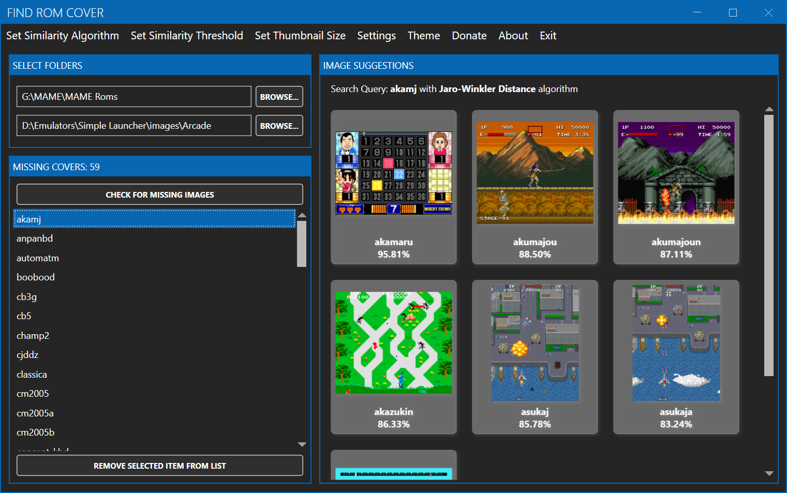

# Find ROM Cover

Find ROM Cover is an easy-to-use application designed to help you effortlessly rename and organize Cover Images for your ROM collection. 
No need to manually rename your images to match the ROM filename. 

## How It Works:

- **Browse:** Select the folders where your ROMs and cover images are stored.

- **List:** List which cover images is missing for your ROM collection.

- **Match:** Search inside the Imagem Cover folder for a Imagem with a similar filename. Adjust the similarity threshold to get the best matches.

- **Display:** Will display on the right panel suggestions of cover images for the selected ROM. You can change the size of the image previews.

- **Organize:** Manually select the best cover images from the suggestions provided.

- **Copy:** Click on the image to copy the image to the Image Cover folder renaming the Image to the same name as the ROM file.

## Features:

- **Easy ROM and Cover Image Matching:** Automatically matches your ROM files with their corresponding cover images based on name similarity.

- **Adjustable Similarity Rate:** Fine-tune how strict the matching criteria should be. Whether you prefer exact matches or broader suggestions, you have control.

- **Thumbnail Size Customization:** Choose how large or small you want the cover image thumbnails to appear, making it easier to view and select the right covers.

- **Manual Selection:** Browse through suggested images and pick the perfect cover for each ROM, ensuring your collection looks exactly how you want it.

- **Missing Image Finder:** Quickly identify which ROMs are missing cover images, so you can focus on completing your collection of images.

- **Simple Interface:** Designed with ease of use in mind, making it accessible for everyone, regardless of your tech-savviness.

## Where can I find ROM Cover Images?

You can find cover images on websites like https://github.com/libretro-thumbnails/libretro-thumbnails or https://emumovies.com/, which I am not affiliated with.

## Screenshots:

## Support the Project:

Did you like Find ROM Cover? Consider [donating](https://www.buymeacoffee.com/purelogiccode) to support the project or just say thanks!

## Developer:

This project was created by a [Simple Launcher](https://github.com/drpetersonfernandes/SimpleLauncher) developer to help him organize his Image Cover collection.

- **Peterson Fernandes** - [Github Profile](https://github.com/drpetersonfernandes)

## Technical Details:

Find Rom Cover was written in C# using Microsoft Visual Studio Community 2022 (64-bit) and the Windows Presentation Foundation (WPF) Framework with Microsoft .NET 8.0. 
This program is Windows-only. Compatibility with Windows 7 and later versions is expected. It has been tested on Windows 11.